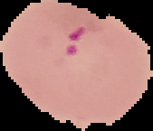
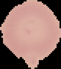
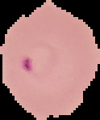
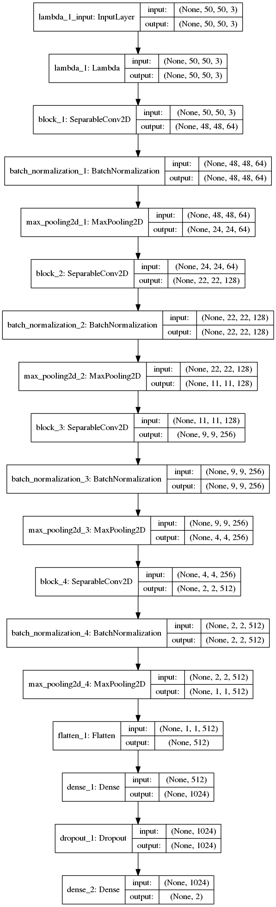

   

# Project Overview
In this kaggle kernel I used a very interesting dataset of Malaria Cell images along with a CNN to classify malaraia cells at a 95% accuracy. With Keras and TensorFlow I was able to construct a model that was able to accuractly detect malaria within cell images.

# Used Within This Kernel
1) Keras
2) TensorFlow
3) Data Augmentation
4) Convolutional Neural Network
5) Callbacks

# Kaggle Kernel
If you would like to visit the kaggle kernel in which I created my submission for the competition it can be found here: https://www.kaggle.com/twhitehurst3/keras-malaraia-detection-95-acc/data

